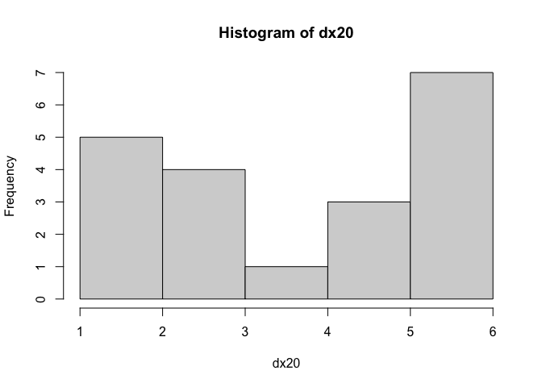
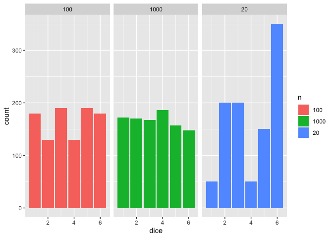
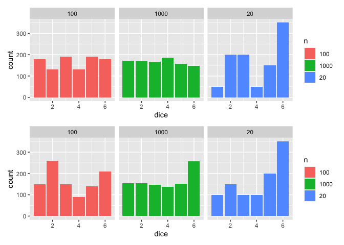
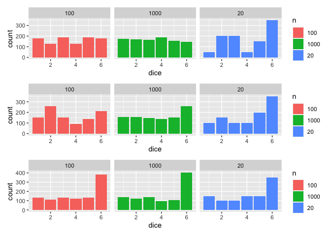

Week 1
================

``` r
knitr::opts_chunk$set(warning=FALSE, message = FALSE)

library(tidyverse)
```

    ── Attaching core tidyverse packages ──────────────────────── tidyverse 2.0.0 ──
    ✔ dplyr     1.1.2     ✔ readr     2.1.4
    ✔ forcats   1.0.0     ✔ stringr   1.5.0
    ✔ ggplot2   3.4.2     ✔ tibble    3.2.1
    ✔ lubridate 1.9.2     ✔ tidyr     1.3.0
    ✔ purrr     1.0.1     
    ── Conflicts ────────────────────────────────────────── tidyverse_conflicts() ──
    ✖ dplyr::filter() masks stats::filter()
    ✖ dplyr::lag()    masks stats::lag()
    ℹ Use the ]8;;http://conflicted.r-lib.org/conflicted package]8;; to force all conflicts to become errors

``` r
library(patchwork)

pets <- read_csv("https://uoepsy.github.io/data/pets_seattle.csv")
```

    Rows: 1956 Columns: 7
    ── Column specification ────────────────────────────────────────────────────────
    Delimiter: ","
    chr (5): license_number, animals_name, species, primary_breed, secondary_breed
    dbl (2): license_year, weight_kg

    ℹ Use `spec()` to retrieve the full column specification for this data.
    ℹ Specify the column types or set `show_col_types = FALSE` to quiet this message.

**Question 1-2**

``` r
summary(pets)
```

      license_year  license_number     animals_name         species         
     Min.   :2015   Length:1956        Length:1956        Length:1956       
     1st Qu.:2017   Class :character   Class :character   Class :character  
     Median :2018   Mode  :character   Mode  :character   Mode  :character  
     Mean   :2018                                                           
     3rd Qu.:2018                                                           
     Max.   :2018                                                           
     primary_breed      secondary_breed      weight_kg      
     Length:1956        Length:1956        Min.   :  0.390  
     Class :character   Class :character   1st Qu.:  4.707  
     Mode  :character   Mode  :character   Median : 16.630  
                                           Mean   : 15.312  
                                           3rd Qu.: 22.500  
                                           Max.   :103.480  

``` r
head(pets)
```

    # A tibble: 6 × 7
      license_year license_number animals_name species primary_breed secondary_breed
             <dbl> <chr>          <chr>        <chr>   <chr>         <chr>          
    1         2018 LNS150171      Norman       Dog     Boxer         Mix            
    2         2017 LN20666        Henry        Dog     Bichon Frise  Havanese       
    3         2018 LN8000658      Vega Willia… Dog     Mix           Unknown        
    4         2018 LN730940       Molly        Dog     Australian S… Mix            
    5         2016 LN964607       Gremy        Dog     Chihuahua, S… Terrier        
    6         2018 LNS117115      Shadow       Dog     Retriever, L… Unknown        
    # ℹ 1 more variable: weight_kg <dbl>

**Question 3**

Pet 47 is called Hooligan

Pet 200 is called Maple Syrup

**Question 4**

``` r
dogs <- pets %>% filter(species == "Dog")
cats <- pets %>% filter(species == "Cat")
```

**Question 5**

The weight of the heaviest cat is 5.48. The lightest dog weighs 0.39.

**Question 6** There are `r`nrow(pets %\>% filter(species != “Cat” &
species != “Dog”))\` that are not dogs. They are both of the species
Goat.

**Question 7**

``` r
pets <- pets %>%
  mutate(round_weight = round(weight_kg,0))
```

**Question 8**

``` r
summary(pets)
```

      license_year  license_number     animals_name         species         
     Min.   :2015   Length:1956        Length:1956        Length:1956       
     1st Qu.:2017   Class :character   Class :character   Class :character  
     Median :2018   Mode  :character   Mode  :character   Mode  :character  
     Mean   :2018                                                           
     3rd Qu.:2018                                                           
     Max.   :2018                                                           
     primary_breed      secondary_breed      weight_kg        round_weight  
     Length:1956        Length:1956        Min.   :  0.390   Min.   :  0.0  
     Class :character   Class :character   1st Qu.:  4.707   1st Qu.:  5.0  
     Mode  :character   Mode  :character   Median : 16.630   Median : 17.0  
                                           Mean   : 15.312   Mean   : 15.3  
                                           3rd Qu.: 22.500   3rd Qu.: 22.0  
                                           Max.   :103.480   Max.   :103.0  

**Question 9**

``` r
dice <- function(num = 1) {
  sum(sample(1:6, num, replace=TRUE))
}
```

**Question 11**

``` r
dx20 <- replicate(20, dice())
```

**Question 12**

``` r
hist(dx20)
```



**Question 13**

``` r
d <- data.frame(dx20 = dx20,
                dx100 =replicate(100, dice()),
               dx1000 = replicate(1000, dice())) %>% pivot_longer(cols = c(dx20,dx100,dx1000), names_to = "n", values_to = "dice", names_prefix = "dx")

p1<-ggplot(d, aes(x=dice, fill = n)) +
  geom_bar() +
  facet_wrap(~n) 

p1
```



**Question 14**

``` r
wdice <- function(num = 1){
    sum(sample(1:6, num, replace=TRUE, prob = c(0.15,0.15,0.15,0.15,0.15,0.25)))
}

wd <- data.frame(wdx20 = replicate(20,wdice()),
                 wdx100 = replicate(100, wdice()),
                 wdx1000 = replicate(1000, wdice())) %>% pivot_longer(cols = c(wdx20,wdx100,wdx1000), names_to = "n", values_to = "dice", names_prefix = "wdx")

p2<- ggplot(wd, aes(x=dice, fill = n)) +
  geom_bar() +
  facet_wrap(~n)

p1/p2
```



**Question 15**

``` r
wdice <- function(num = 1){
    sum(sample(1:6, num, replace=TRUE, prob = c(0.15,0.15,0.15,0.15,0.15,0.5)))
}

wd2 <- data.frame(wd2x20 = replicate(20,wdice()),
                 wd2x100 = replicate(100, wdice()),
                 wd2x1000 = replicate(1000, wdice())) %>% pivot_longer(cols = c(wd2x20,wd2x100,wd2x1000), names_to = "n", values_to = "dice", names_prefix = "wd2x")

p3<- ggplot(wd2, aes(x=dice, fill = n)) +
  geom_bar() +
  facet_wrap(~n)

p1/p2/p3
```


