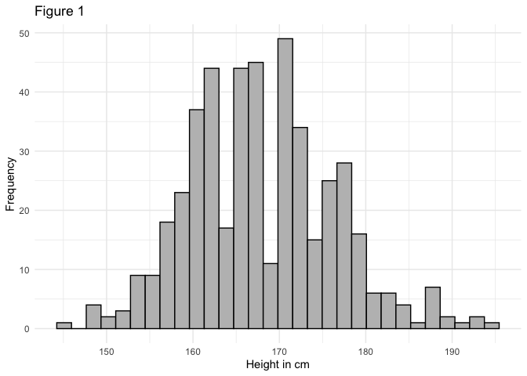
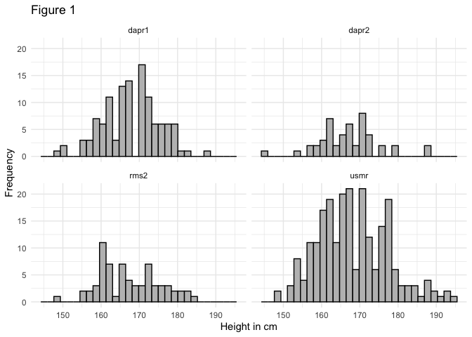

Week 2 lab exercises
================

**Question 1**

``` r
knitr::opts_chunk$set(warning=FALSE, message = FALSE)

library(tidyverse)
```

    ── Attaching core tidyverse packages ──────────────────────── tidyverse 2.0.0 ──
    ✔ dplyr     1.1.2     ✔ readr     2.1.4
    ✔ forcats   1.0.0     ✔ stringr   1.5.0
    ✔ ggplot2   3.4.2     ✔ tibble    3.2.1
    ✔ lubridate 1.9.2     ✔ tidyr     1.3.0
    ✔ purrr     1.0.1     
    ── Conflicts ────────────────────────────────────────── tidyverse_conflicts() ──
    ✖ dplyr::filter() masks stats::filter()
    ✖ dplyr::lag()    masks stats::lag()
    ℹ Use the ]8;;http://conflicted.r-lib.org/conflicted package]8;; to force all conflicts to become errors

``` r
psy_stat <- read_csv("https://uoepsy.github.io/data/surveydata_historical.csv")
```

    Rows: 473 Columns: 19
    ── Column specification ────────────────────────────────────────────────────────
    Delimiter: ","
    chr  (8): birthmonth, eyecolour, catdog, threewords, course, in_uk, gender, ...
    dbl (11): height, year, optimism, spirituality, sleeprating, extraversion, a...

    ℹ Use `spec()` to retrieve the full column specification for this data.
    ℹ Specify the column types or set `show_col_types = FALSE` to quiet this message.

**Q2**

There are 46 students born in July like me.

**Q3**

``` r
psy_stat <- psy_stat |>
  mutate(taller = height > 182)

head(psy_stat)
```

    # A tibble: 6 × 20
      birthmonth height eyecolour catdog threewords         year course in_uk gender
      <chr>       <dbl> <chr>     <chr>  <chr>             <dbl> <chr>  <chr> <chr> 
    1 may           154 brown     cat    Short Passiote C…  2020 usmr   Else… <NA>  
    2 sep           158 brown     cat    creative, curiou…  2020 usmr   <NA>  <NA>  
    3 jun           158 brown     cat    creative, reflex…  2020 usmr   UK    <NA>  
    4 jun           158 other     cat    smart diligent l…  2020 usmr   <NA>  <NA>  
    5 mar           159 brown     cat    introvert, smart…  2020 usmr   Else… <NA>  
    6 jan           160 brown     cat    passioted, dilig…  2020 usmr   <NA>  <NA>  
    # ℹ 11 more variables: optimism <dbl>, spirituality <dbl>, ampm <chr>,
    #   sleeprating <dbl>, extraversion <dbl>, agreeableness <dbl>,
    #   conscientiousness <dbl>, emot_stability <dbl>, imagination <dbl>,
    #   loc <dbl>, taller <lgl>

**Q4**

Of those who reported their height 4.3103448 % are taller than 182

**Q5**

``` r
psy_stat |>
  summarise(
    mean = mean(height, na.rm = T),
    sd = sd(height, na.rm = T)
  )
```

    # A tibble: 1 × 2
       mean    sd
      <dbl> <dbl>
    1  168.  8.39

**Q6**

``` r
 ggplot(psy_stat, aes(x = height))+
  geom_histogram(fill = "grey", color = "black", na.rm = T) +
  labs(x= "Height in cm", y = "Frequency", title = "Figure 1")+
  theme_minimal()
```



**Q7**

``` r
psy_stat |>
  group_by(course) |>
  summarise(
    mean = mean(height, na.rm = T),
    sd = sd(height, na.rm = T)
  )
```

    # A tibble: 4 × 3
      course  mean    sd
      <chr>  <dbl> <dbl>
    1 dapr1   168.  7.36
    2 dapr2   167.  7.79
    3 rms2    167.  7.98
    4 usmr    168.  9.13

**Q8**

``` r
 ggplot(psy_stat, aes(x = height))+
  geom_histogram(fill = "grey", color = "black", na.rm = T) +
  facet_wrap(~course)+
  labs(x= "Height in cm", y = "Frequency", title = "Figure 1")+
  theme_minimal()
```



**Q9** There are 9 missing data points for height

**Q10** There are 114 students taller than me. That is, 24.5689655 %.

**Q11**

``` r
sleep_qual <- psy_stat |>
  filter(course == "usmr" & year == 2022 & is.na(sleeprating) == F)
```

**Q12**

``` r
sum <- sleep_qual |>
  summarise(
    mean = mean(sleeprating),
    sd = sd(sleeprating),
    n = n()
  )

sum
```

    # A tibble: 1 × 3
       mean    sd     n
      <dbl> <dbl> <int>
    1  66.0  22.6    79

**Q13** The boundaries of a 95 % confidence interval of the mean sleep
rating (65.9873418) is 60.9977947 and 70.9768888
